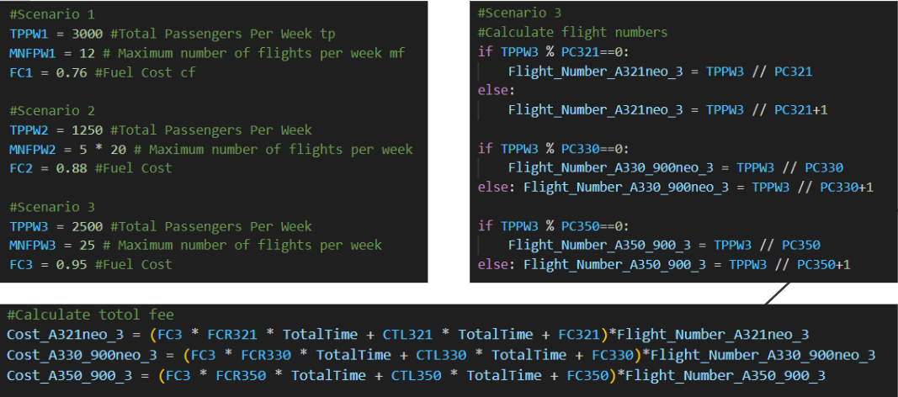

# AAE1001-Group-9

## Members

**Leader:** 
AL AKIB Ahmad Munjir - "AM-Al-Akib"

**Member 2:** 
Chik Long Tin - "kakachik"

**Member 3:** 
Ni Shuyu - "nishuyu"

**Member 4:**
Leung Siu Kwan - "230Jonas"

**Member 5:**
XIE TIANZHUO - "rudolphzhuo"

**Member 6:**
LongYiqi - "longyiqi"

**Member 7:**
Missing!!!!!

## Content

* [About Path Planning in Aviation](#about-path-planning-in-aviation)
* [Theory of Path Planning Algorithm](#theory-of-path-planning-algorithm)
* [Project Video](#Project-Video)
* [Task 1](#task-1)
* [Task 2](#task-2)
* [Task 3](#task-3)
* [Task A1](#task-A1)
* [Task A2](#task-A2)
* [Task A3](#task-A3)
* [Reflections](#Reflections)
* [References](#References)

## About Path Planning in Aviation
Ensuring cost efficiency and passenger satisfaction stands as a pivotal determinant of an airline's success. However, orchestrating a flight from one point to another isn't a straightforward task of just transporting passengers and cargo safely and punctually. The airspace, that expansive canvas of sky above, is essentially claimed by the countries residing beneath it as their territorial domain, often extending up to FL600. Unauthorized entry into this airspace would breach the sovereignty of the respective nation. Thankfully, the Five Freedoms of Air exist to facilitate aviation, though airlines are burdened with charges for traversing foreign airspace.

Beyond diplomatic considerations, the aviation industry grapples with physical obstacles that impact flight paths. These include formidable barriers such as high terrains, ranging from hills to mountains, areas afflicted by adverse weather conditions, and even towering skyscrapers that can impose constraints on an aircraft's mobility during takeoff and landing. 

The crux of this project lies in the pursuit of identifying the most efficient pathway for a flight navigating through a maze of real-world challenges. Leveraging cutting-edge technologies and methodologies, we aim to optimize flight paths under diverse circumstances, ensuring a harmonious blend of safety, cost-effectiveness, and passenger convenience.

## Theory of Path Planning Algorithm
  Navigating through path planning constitutes a pivotal challenge in robotics research, with its solutions proving instrumental across diverse fields. The application of path planning spans from guiding robots towards specific objectives involving tasks as straightforward as trajectory planning to the intricacies of selecting a well-suited sequence of actions. The implementation of apt algorithms plays a key role, enabling the broad applicability of path planning in both partially known and unknown structured environments.

Local path planning, a significant facet, involves the generation of paths by assimilating data from sensors while the robot is in motion. This dynamic process empowers the robot to adapt and generate new paths based on real-time environmental data, enhancing its practical utility. In essence, local path planning ensures adaptability in navigating through changing surroundings.

Four paramount trade-off criteria are essential considerations in any path-planning algorithm. Optimization, completeness, precision, and execution time stand as key pillars shaping the efficacy of a path-planning approach [1]. Striking a balance among these criteria is crucial for developing path-planning solutions that are not only effective but also efficient in real-world applications.

## Project Video

[

## Task 1
### Goal:
Find an appropriate aircraft model that can achieve minimum cost for each scenario. 

### Methodology:
For the first task, we need to find the most cost-effective aircraft for three different scenarios. To solve this task, first, we changed the codes of the borders of the cost-intensive areas to match them with our scenarios. Then, we added the conditions of the three scenarios provided and that of the aircraft in our code. After that, we added a calculating system in our code so that it could automatically calculate how much cost each aircraft would have by analyzing all the data we provided.

### Most Efficient Path

  
  

### Result of The Scenarios
  The most suitable aircraft for the first, second, and third scenarios are the A330, A350, and A330, respectively.
  
  ### Task 1 - Scenario 1 Code:
  

  
  

  

  ### Result for scenario 1:

  

  
  

  ### Task 1 - Scenario 2 Code:

  

  
  

  
  ### Result for scenario 2:

  

  
  

  ### Task 1 - Scenario 3 code:

  

  
  

  
  ### Result for scenario 3:

  

  
  

  
### Discussion
The first task was to find an appropriate aircraft model that achieved the minimum cost for the challenge assigned. The first scenario is to consider 3000 passengers traveling within one week when the maximum number of flights that we can afford is 12 per week. The time cost should be medium, and the fuel cost should be 0.76$/kg. Considering this scenario, the most appropriate aircraft is A330-900neo.In this case, A321 can't meet the requirements. And the cost of aircraft A350 is much more than A330. The second scenario is where 1250 passengers travel within this month, and we can afford 5 flights per week, which makes it 20 flights per month. In this scenario, the most profitable aircraft model is the A350-900. And the third scenario is where 2500 passengers need to travel within this week and only 25 flights can be afforded within this week. Considering the circumstances of this particular scenario, the best aircraft model is A330-900neo because it is the most cost-effective. 

## Task 2
### Goal
To design a new jet stream area which reduces cost by 5%

### Background
The jet stream refers to a narrow and high-altitude air current in the atmosphere, where aircraft will consume less time and fuel while cruising. It is characterized by high wind speeds and is mainly formed due to temperature and pressure differences in the atmosphere. 

  
  

### Methodology
With the scenario same as Task 1 as the background, we need to find the specific area to set the jet stream where the cost of flight cab is reduced by 5%。 The specific area is also required to span across the map laterally and span a 5-unit length vertically.

### Coding section

  
  

This is the part where we have added the jet stream area. We have set a range and chosen the best area for the jet stream based on the best value.

### Results

  
  

For the results, we can conclude that after the use of the jet stream area, the total cost of A330-900 neo is around 85000 USD, while the total cost of A350-900 is around 88300 USD. Furthermore, we can know that A321 neo is not viable in this scenario.

## Task 3 : Methodology Results and Discussion

### Methodology
In this task, we designed one imaginary aircraft named G911. Here we were using Python automatically to calculate the cost and other credentials for this imaginary plane.

### Result

  
  

### Discussion
In our coding process, we used necessary data and coding to calculate "Total Trip time," "Total Cost," and "Total Passenger Capacity". Here, we tried to decide which plane type is better for this scenario. Is it the dual-engine model or the four-engine one.

## Task A1
### Goal
1. To add one checkpoint for each cost-intensive area(2 in total) 2. To reach all checkpoints before arriving at the destination.

### Background
The primary goal is to deliver essential supplies to two separate locations. These supplies could range from medical and food supplies to technical equipment or humanitarian aid. Precise planning is essential, involving precise calculations for fuel, timing, and the safest and most efficient routes to reach the drop-off points and return to base. The primary mission of the supply craft is the swift and efficient delivery of crucial supplies to two high-priority, cost-intensive areas. Central to this mission is strategic route planning, which focuses on creating the most direct and practical path between these checkpoints. This optimized routing is key to minimizing travel time and fuel consumption, ensuring the prompt delivery of essential items like medical and food supplies and technical or humanitarian aid.

### Methodology 
In the given scenario from Task 1, our objective is to refine an existing pathfinding algorithm to incorporate two designated checkpoints within cost-intensive areas automatically. Modify our pathfinding algorithm to include these checkpoints as required waypoints. Once the optimal route is calculated, it should be visualized on the graph. This typically involves plotting the route over a map or graph, with checkpoints and cost-intensive areas clearly marked.

### Coding section

  
  

To ensure the A* search algorithm routes the aircraft through the required checkpoints, we modify the 'self.fc_' attribute to represent the x and y coordinates of the two designated checkpoints. By setting the 'node.cost' to zero for these checkpoints, the algorithm is compelled to prioritize these waypoints, effectively guiding the aircraft through these specific locations without adding additional cost to the pathfinding calculation. This strategic adjustment allows the algorithm to integrate the required checkpoints into the optimal route seamlessly.

  
  

At this stage, we will visualize the two checkpoints by marking them in green on the plot.

### Result

  
  

## Task A2
### Goal 

To find the route of minimum cost when obstacles are generated randomly with reasonable density. 

### Background 

Assume the mission and the environment keep changing for each operation. 

1. Only the fuel-consuming area remains and generates it randomly with a fixed area (40x40) 

2. Diagonal movement is disabled, change parameter(s) so that the object could travel within one grid size 

3. Obstacles are generated randomly with reasonable density 

4. Destination and starting points are generated randomly with at least a 40-unit distance in-between 

5. Plotting of the fuel-consuming area would not cover the obstacles, and obstacles should not be generated at/near the start and end point 

### Methodology 

In the given scenario from Task 1, the obstacles are fixed, and diagonal movement is allowed. However, in this task, the diagonal movement is disabled, and the obstacles are generated randomly. Therefore, the most challenging part of Additional Task 2 is to modify the code so that the obstacles and the fuel-consuming area can be generated appropriately. Meanwhile, the density of the obstacles must be appropriate. 

### Results 

  
  

  
  

  
  

### Discussion 

If the obstacle density is too high, sometimes the route can not be found because there is no available route for the situation. ChatGPT provides a method to control the density. 

  
  

Sometimes obstacles may be generated on the position of the start or end nude, which could cause confusion to the code. Thus, the obstacles need to be modified. 

  
  

## Task A3

**Goal**: To test other unalike algorithms for finding the most efficient path.

**Methodology**: We have to choose 2 additional different algorithms from the GitHub platform and compare all 3 codes with outcomes together, with the same obstacle design.

**Result for BFS (sped up by x5)**:

   

Without a doubt, BFS planning requires a considerably longer time compared to A planning. The process of calculating and determining the optimal pathway from the starting point to the destination takes a substantial amount of time. We have even enhanced the speed by a factor of 5 on our GitHub. However, when comparing these two programs, we highly recommend utilizing A path planning as it significantly reduces the time required.

**Results for Dijkstra (sped up by x5)**:

  
  

After examining the outcomes of two different coding approaches, it can be concluded that Dijkstra's algorithm finds longer flight paths for the aircraft compared to A path planning, but it is significantly faster than BFS. Even with a 5x speed improvement, Dijkstra's algorithm still takes considerable time due to its extensive path searching. On the other hand, BFS, despite being sped up by 5x, requires even more time for calculations and finding the final path. Therefore, it is evident that A* path planning is the optimal choice for our project. It efficiently reaches the goal point in the shortest possible manner. Hence, selecting A* path planning was the most suitable decision for our coding project.

## Reflection

### AL AKIB Ahmad Munjir's Reflection: 
The path planning project was a real rollercoaster, especially given my role as the group leader. Initially, the whole coding seemed like a daunting task, especially since my teammates had no experience in coding, and I did not have any prior experience with path planning. However, leading the group required more than coding skills; it demanded effective management to ensure we did not crash and burn.

Being the leader meant more than just keeping an eye on coding tasks. It meant understanding the strengths and weaknesses of each team member and dishing out responsibilities accordingly. Real talk – not everyone was a coding whiz, so I played smart while coding by getting help from AIs when I couldn’t understand the format or logic behind something. This made coding less of a nightmare.

While leading my group, project management became my new best friend. Organizing the team, setting targets, and throwing deadlines on the table became necessary. Though I couldn't start the project as planned because of a lack of communication issues with my group mates, I was fortunate to start and finish before the deadline. Breaking down the GitHub project into smaller tasks for the team was my way of making sure everyone could chip in.

While the main focus was on coding, the project took us into the nitty-gritty of aviation knowledge and industry terms. Embracing the idea of continuous learning, I dove headfirst into challenges, gaining a deeper understanding of Python coding and the complexities of aviation path planning.

Choosing to work with existing code and a bit of project juggling turned what could have been a coding nightmare into a collaborative learning adventure. It wasn't just about meeting coding requirements; it was about appreciating the intricacies of aviation path planning.

To sum it up, the path planning project was a wild ride that taught me more than just coding. After the experience of leading this group, it was not like just a walk in the garden. Instead, I had to handle many things that were not meant to be initially dealt by me. Still, as mentioned before, my teammates had no coding experience, so I had to do many things while keeping in mind the deadline, but after all, I'm thankful for the team's support and contributions. Together, we ticked off the project's goals, and I tried to maintain a positive learning space.

I look forward to having more learning experiences like this path-planning project in the future.
Then, I hope I’ll be able to reflect on what I learned here. And in this way, I want to increase my understanding of the nitty-gritty of aviation knowledge and industry terms.

--------------------------------------------------------------------------------------------------------------------------------------------------------------------
### Long Yiqi's Reflection:
It is a pretty surprise for me after heard the requirement from the professor. As a mainland student who just come less than half a year, the coding program is totally a strange area for me, as there is not any course that related to the python. Luckily, it is not necessary for us to do the entire coding, but just adjust some part in the text that professor given to us. After the group discussion, I realize that a complete rookie in coding can done this task if he is willing to learn few by himself. After changed some values and it run perfectly, I was so delighted at the time I successfully run the code. I also find coding is so interesting therefore spending some time to do research. As I am doing additional task 3 coding, it improved my technical skills and make me have more confidence on it. I really enjoy the group working and proud to be a member of this group. After this mission, I realized that coding is also an important and effective tool in aviation industry. I am appreciating to the experience in this group project and other group mates in this group, without them, I cannot done this task, gain more knowledge and meet more friends.

--------------------------------------------------------------------------------------------------------------------------------------------------------------------
### Leung Siu Kwan's Reflection:
The objective of my assignment is to develop an add-on for the code created in Task 1, presenting a blend of straightforward tasks and engaging challenges. The simplicity lies in the foundation provided by the pre-existing code, which spares me from starting from scratch and allows me to focus on modifying and enhancing specific sections. Conversely, the complexity emerges from the necessity to meticulously review and comprehend the original code to determine the precise areas that require adjustments. The analytical process of dissecting the entire codebase is intellectually gratifying, especially when I achieve a thorough understanding of its mechanics and successfully integrate my contributions.

Additionally, contributing to the GitHub README has been an enjoyable aspect of the project. There's a certain pleasure in committing incremental changes and observing the evolution of the document over time. Witnessing the culmination of these small, yet significant, contributions into a comprehensive final product is immensely satisfying. This experience not only enhances my technical skills but also provides a sense of accomplishment in the collaborative and iterative nature of coding.

--------------------------------------------------------------------------------------------------------------------------------------------------------------------
### Chik Long Tin's Reflection: 
I was both surprised and concerned when I realized that coding was necessary for this project. Despite having no prior experience and never anticipating the need to code after high school,  I was assigned to finish Task 2 after discussing with my teammates. Task 2 involved creating a jet stream area with a 5% cost reduction. While I initially thought I would have to write the code from scratch, I soon realized that I only needed to make modifications from the code already existing. However, when I started working on it, I found myself, without no surprise, struggling to generate any thoughts. Fortunately, my teammates were patient and guided me through each step of the process. Gradually, I became adept at handling the code and successfully completed the task, for which I felt immensely grateful. This project made me realize the importance coding in the aviation industry like path planning, which is the field I aspire to work in. As a result, it has strengthened my determination to learn coding in the future.

--------------------------------------------------------------------------------------------------------------------------------------------------------------------
### Xie TianZhuo's Reflection:
At the beginning, I was very stressful when I received the task, because I had had no such experience in typing code. Meanwhile, my computer got some technical issue that I couldn’t set the environment variables for Python. I tried several times but failed. VScode and ‘py -m pip’ helped me solve the problem.  with the help of ChatGPT, I made a successful attempt by sending the requirements to ChatGPT. ChatGPT provided an initial page of code with some mistakes, and I continued to type my instructions. Finally, the code became more and more completed and satisfied the requirements. From my point of view, ChatGPT played an very important role in the task-solving progress. I could not handle the whole task without the help of ChatGPT. From this task, I learn that I need to continue to learn more about Python.

--------------------------------------------------------------------------------------------------------------------------------------------------------------------
### Ni Shuyu's Reflection:

##### Since I was primarily focused on Task 3 and deciding what type of aircraft we wanted to design, this project really gave me an understanding of the algorithms behind the aviation industry in order to maximize profit prices and meet market demand despite skyrocketing fuel. Due to various constraints, it has never been easy to identify the aircraft best suited for the route, let alone design a new aircraft to fit the existing market. During this project, our group had a lot of discussions about whether a smaller twin-engine aircraft or a larger four-engine aircraft would be best suited for the scenarios we were given and what future trends in aviation would be. As a result, we are able to optimize costs and revenue per flight as it has a significant impact on the financial health and sustainability of the airline. Additionally, this project provided me with the fundamentals of coding, an area that will be critical for the future growth of the aviation industry in terms of safety and profitability. I look forward to applying the knowledge gained from this project into my future career. I really enjoyed working on this project and helping with the calculations involved in the code. I would like to thank everyone again for all their hard work on this project.
--------------------------------------------------------------------------------------------------------------------------------------------------------------------

## References

[1]A. Montazeri, A. Can, and I. H. Imran, “Unmanned aerial systems: Autonomy, cognition, and Control,” Unmanned Aerial Systems, pp. 47–80, 2021. 

